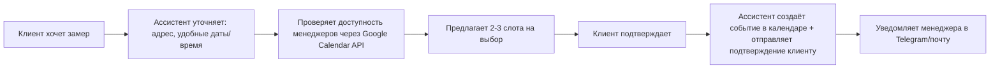

# 🪟 ИИ-ассистент для компании по установке окон
ссылка на проект-@Narodiyokoshko_bot
>
> 
> ## 📋 Общая информация

| Параметр | Значение |
|----------|----------|
| **Название проекта** | ИИ-ассистент для компании по установке окон |
| **Тип решения** | Чат-бот / Виртуальный консультант |
| **Целевая аудитория** | Менеджеры по продажам, клиенты компании, техническая поддержка |
| **Платформа** | Веб-чат, мессенджеры (Telegram, WhatsApp), сайт компании |
| **Статус** | ✅ Готов к внедрению |

---

## 🎯 Цели и задачи проекта

### Бизнес-цели:
- 📈 Увеличить конверсию заявок в замер/продажу на 20-35%
- ⏱ Сократить время обработки первичного обращения с 15 мин до 30 сек
- 💰 Снизить нагрузку на менеджеров за счёт автоматизации рутинных вопросов
- 🌙 Обеспечить поддержку клиентов 24/7 без увеличения штата

### Функциональные задачи:
```
✅ Осмысленное ведение диалога с помощью нейросети
✅ Ответы на вопросы по базе знаний (продукты, цены, гарантии)
✅ Квалификация лида: сбор контактов, типа объекта, сроков
✅ Запись клиента на встречу/замер
✅ Автоматическое добавление встречи в Google Календарь
✅ Передача «тёплого» лида менеджеру с контекстом диалога
```

---

## ⚙️ Функционал детально

### 1. 🤖 Осмысленное ведение диалога

| Возможность | Описание |
|-------------|----------|
| **Контекстная память** | Помнит историю диалога в рамках сессии, не переспрашивает одно и то же |
| **Тон и стиль** | Дружелюбный, профессиональный, без «роботизированных» фраз |
| **Работа с возражениями** | «Дорого» → предлагает рассрочку/акцию; «Думаю» → отправляет кейсы/отзывы |
| **Мультиязычность** | Поддержка русского языка с возможностью расширения |

**Пример диалога:**
```
Клиент: Сколько стоит окно в спальню?
Ассистент: Чтобы назвать точную цену, уточните: 
• Размер окна (примерно)? 
• Нужен ли подоконник и откосы? 
• Интересует пластиковый профиль или деревянный?

[После ответа клиента]
Ассистент: Для окна 140×150 см с монтажом «под ключ» 
стоимость составит от 24 500 руб. 
Хотите, я подберу 2-3 варианта под ваш бюджет и 
запишу на бесплатный замер?
```

### 2. 📚 Ответы на вопросы по базе знаний

**Источники знаний (загружены в векторную базу):**
- Прайс-листы и конфигураторы продукции
- Технические характеристики профилей, стеклопакетов, фурнитуры
- Условия гарантии, сроки изготовления, этапы монтажа
- Ответы на частые вопросы (FAQ): «Что входит в монтаж?», «Как подготовить проём?», «Есть ли рассрочка?»
- Реальные кейсы и отзывы клиентов

**Механика работы:**
```
1. Клиент задаёт вопрос → 
2. ИИ ищет релевантный фрагмент в базе знаний (RAG-подход) → 
3. Формирует ответ своими словами с указанием источника → 
4. Если информации нет — честно говорит и передаёт менеджеру
```

### 3. 📅 Запись на встречу + Google Календарь

**Сценарий записи:**


**Данные, фиксируемые в календаре:**
- 📍 Адрес объекта
- 👤 Контактные данные клиента
- 🪟 Тип заявки (окно ПВХ / балкон / остекление коттеджа)
- 💬 Краткая история диалога (контекст для менеджера)
- 🔔 Напоминание за 2 часа до встречи

---

## 🛠 Техническая архитектура

```
┌─────────────────┐
│   Клиент        │
│ (сайт/мессенджер)│
└────────┬────────┘
         │
         ▼
┌─────────────────┐
│   Suvvy.ai      │ ◄── Платформа для создания ИИ-ассистента
│ • Оркестрация   │     (диалоги, интеграции, аналитика)
│ • Управление    │
│   сессиями      │
└────────┬────────┘
         │
    ┌────┴────┐
    ▼         ▼
┌────────┐ ┌─────────────┐
│  Qwen  │ │ База знаний │
│ (LLM)  │ │ (векторная) │
│• Генерация│ • Документы│
│  ответов │ • Прайсы   │
│• Понимание│ • Кейсы   │
│  намерений│ • FAQ     │
└────┬────┘ └──────┬──────┘
     │            │
     ▼            ▼
┌─────────────────────┐
│ Интеграции          │
│ • Google Calendar   │ → Запись встреч
│ • CRM (опционально) │ → Передача лида
│ • Telegram Bot API  │ → Уведомления
└─────────────────────┘
```

### Используемые сервисы:

| Сервис | Роль в проекте | Ссылка |
|--------|---------------|--------|
| **Qwen** | Языковая модель для создания системного промпта, генерации ответов и работы с базой знаний (RAG) | [Qwen Official](https://qwenlm.github.io/) |
| **Suvvy.ai** | No-code платформа для сборки ИИ-ассистента: диалоговый движок, интеграции, аналитика, управление знаниями | [https://suvvy.ai/](https://suvvy.ai/) |
| **Google Calendar API** | Синхронизация расписания, создание событий, проверка доступности слотов | [Google Cloud](https://cloud.google.com) |

---

## 🧠 Системный промпт (фрагмент)

```markdown
Ты — виртуальный консультант компании «ОкнаПрофи». 
Твоя цель: помочь клиенту подобрать решение, ответить на вопросы 
и записать на бесплатный замер.

Правила:
1. Будь дружелюбным, но профессиональным. Избегай сленга.
2. Не выдумывай цены и характеристики — используй только базу знаний.
3. Если не знаешь ответа — честно скажи и предложи связаться с менеджером.
4. Собирай контакты (имя, телефон) только после того, как клиент проявил интерес.
5. При записи на замер всегда уточняй: адрес, тип объекта, удобные даты.
6. После подтверждения встречи — отправь клиенту краткое резюме и контакты менеджера.

Тон: заботливый эксперт, который экономит время клиента.
```

---

## 🚀 Этапы внедрения

| Этап | Срок | Результат |
|------|------|-----------|
| **1. Подготовка** | 1-2 дня | Сбор и структурирование базы знаний (прайсы, FAQ, скрипты) |
| **2. Настройка в Suvvy** | 2-3 дня | Создание ассистента, загрузка промпта, подключение Qwen |
| **3. Интеграции** | 1-2 дня | Подключение Google Calendar, тестирование записи встреч |
| **4. Тестирование** | 2 дня | Проверка сценариев, отладка ответов, нагрузочное тестирование |
| **5. Запуск** | 1 день | Публикация на сайте/в мессенджерах, обучение менеджеров |
| **6. Мониторинг** | постоянно | Анализ диалогов, дообучение базы, A/B-тесты промптов |

**Общий срок запуска**: 7-10 рабочих дней

---

## 📊 Ожидаемые метрики эффективности

| Метрика | До внедрения | После внедрения (целевое) |
|---------|-------------|---------------------------|
| Время ответа на заявку | 5-15 мин | < 30 сек |
| Конверсия в замер | 18-22% | 25-35% |
| Доля рутинных вопросов к менеджерам | ~60% | < 20% |
| Удовлетворённость клиентов (CSAT) | 4.1/5 | 4.6+/5 |
| Стоимость лида | 850 руб. | 550-650 руб. |

---

## 🔐 Безопасность и соответствие

- ✅ Все данные клиентов передаются по защищённому каналу (HTTPS)
- ✅ Доступ к Google Calendar — только на создание/чтение событий, без прав на удаление
- ✅ Логи диалогов хранятся 30 дней, затем анонимизируются
- ✅ Соответствие 152-ФЗ: при сборе контактов — обязательное согласие на обработку

---

## 🔄 Дальнейшее развитие

```
🔜 Этап 2:
• Интеграция с CRM (Битрикс24 / amoCRM) — автоматическое создание сделок
• Голосовой интерфейс — приём звонков через телефонную сеть
• Аналитика возражений — автоматическое выявление «узких мест» в продажах

🔜 Этап 3:
• Персонализация: ассистент «узнаёт» постоянных клиентов и предлагает доп. услуги
• Мульти-оконность: ведение нескольких диалогов с одним клиентом (чат + звонок)
• Самообучение: автоматическое пополнение базы знаний из успешных диалогов
```

---

> 💡 **Ключевое преимущество**:  
> Ассистент не заменяет менеджеров — он **освобождает их время** для работы с «горячими» клиентами, пока сам обрабатывает первичные обращения, отвечает на частые вопросы и квалифицирует лиды.

---

*Документ подготовлен для внутреннего использования. Версия 1.0 | Обновлено: март 2026*
